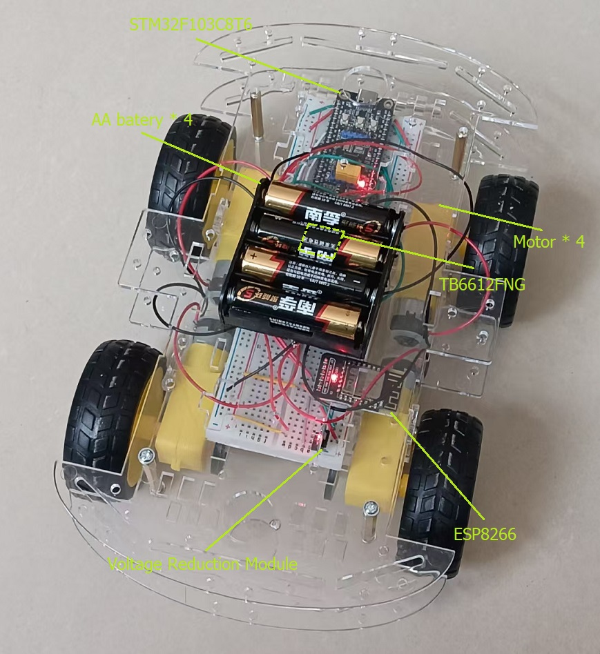
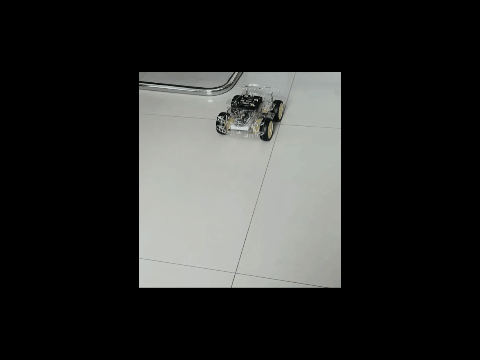
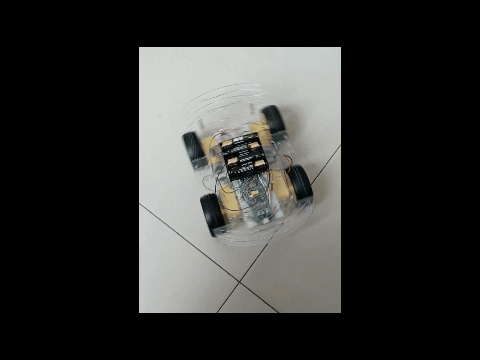
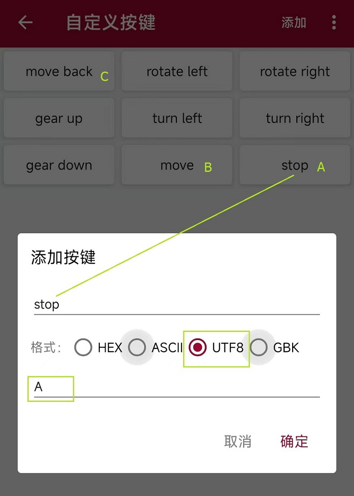

# MVP 1: Remote Control Car with PID

Connect car's Access Point and send char, then it move!

It's a Keil5 project generated by STM32CubeMX.
Hardwares include MCU(STM32F103C8T6), WiFi peripheral(ESP8266), 4 motors, motor driver(TB6612FNG) and car chassis.
Work logic: car opens AP, phone connects and sends char, car actions according to command.

Command		->		Terminal UDP	->		ESP8266(AP)		->	MCU			->		Motor Driver	-> 		4 motors

# How to develop:

## 1. STM32CubeMX
Create a STM32F103C8T6 project. Set debug mode to "Serial Wire". Set HSE and LSE to "Crystal/ Ceramic Resonator".
Set TIM1 Channel 1 and TIM2 Channel 1 to "PWM generation CH1". They work at PA8 and PA0. Prescaler is 72 - 1 so u get 72MHz / 72 = 1Mhz. Counter Period(Auto Reload Register) is 100.
(Optional)Set USART1 mode to "Asychronous", which used to output debug information.
Set USART2 mode to "Asychronous". Add DMA Request "USART2_RX", Direction "Peripheral to Memory". Ensure "USART2 global interrupt" is  Enabled. This receives bytes from WiFi.
Set PA4 "GPIO_Output", which connects to Motor Driver STBY, which works only if STBY pin is high.
In "Clock Configuration", set "HCLK (MHz)" to 72.
Just generate code or set any else u want.

## 2. Keil 5
Open generated project.
I overwrite function "HAL_UARTEx_RxEventCallback(UART_HandleTypedef* huart, uint16_t size_t)", which is called each time USART2 finishes receiving bytes. 
As I mentioned, received bytes are stored at "buffer_RX". We deal with that at "ExecuteCommand" and call "HAL_UARTEx_ReceiveToIdle_DMA" to start a new receiving after dealing.
Meanings from 'A' to 'G' are obvious at enum type "CarState". U can set any for it.
We change car speed by change ducy cycle(Capture Compare Register) of Motor Driver output. When this CCR varies from 0 to ARR(we set it 100 previously), output power varies from 0 to 100%.
More details in comments!

Build to get "MVP1.hex" and download it to MCU.

## 3. Car
I series connect 4 AA batteries(IEC: LR6 battery) to get 1.5V * 4 = 6V. STM32F103 usually works at 3.3V or 5V, so I add a voltage reduction module to get 5V.
1 motor driver outputs 2 circuits so I parallel connect left 2 motors to AON and right 2 ones to BON. Each motor has 2 pins to AON1+AON2(left) or BON1+BON2(right). If program doesn't change, AON1+AON2 and AON2+AON1 are opposite for motor direction. But we change that in program as wires are fixed when we finish it.

Pinout:(I omit some VDD, VCC and GND)

WiFi			MCU
TXD		->		PA3(MCU.USART2.RXD)
RXD		->		PA2(MCU.USART2.TXD)

MCU				Motor Driver
PA4		->		STBY
PA15	   ->		AIN1
PB13	   ->		AIN2
PB14	   ->		BIN1
PB15	   ->		BIN2
PA8		->		PWMA
PA0		->		PWMB

Motor Driver
AON1	->		front left and left rear motors +
AON2	->		front left and left rear motors -
BON1	->		front right and right rear motors +
BON2	->		front right and right rear motors -
(Orders of connecting motors doesn't matter. Just make direction clear.)

Photo-electric switch

Left one out -> PB0.

Right one out -> PB1.

## 4. Remote Control

You can use any device to control as long as it could connect to AP and send UDP data.

I choose my phone and install a UDP debug tool which could send UDP. I set some buttons which send different char to control car.

With my code, 'A' to 'I'(alse '0x41' to '0x49') means these movements.

## 5. PID control

At version 2, I add Propotional Integral Differential control to balance left and right rotation speed.

First is to get rotation speed. I add two photo-electric switch on left front wheel and right front wheel. They trigger External Interrupt of STM32F103 and you can use that to count by rewrite function HAL_GPIO_EXTI_Callback(uint16_t pin). I set EXTI0 at PB0 and EXTI1 at PB1, so at above function, parameter pin would be GPIO_PIN_0 or GPIO_PIN_1, which is triggered by left sensor or right one.There are 20 holes at my photo-electric switches, and 2 variables for count severally. When it reaches 20, relevant wheel turnt a circle. Revolutions Per Minute is 1 / interval[ms] * 1000 * 60[s]. HAL_GetTick returns time count in milliseconds, so just simplify it as 60000 / (HAL_GetTick() - lasttick). 

Second is to construct the PID function. I choose the incremental PID control, which returns the difference instead of the value. 3 parameters Kp, Ki, Kd are basic. Variables error_1 is last record error and error_2 is last one before last. Now you can get the increment. Besides I add a limit to return despite negative or positive so it would not be oscillatory.

Third is to apply the PID control. You can see that I add PID at start of code block while(1) so that it excutes periodically. Strictly speaking, PID excution interval is not constant as it just gets next loop or does something which depends on variable completed. If you want higher precision, use TIM, and study function HAL_TIM_PeriodElapsedCallback.

I got nice PID parameters(Kp = 0.4, Ki = 0.1, Kd = 0). That would be different at other devices. Kd is 0 means proportional and integral control is enough. Differential is to reduce system overshoot and oscillation. For some simple problems, oscillation is negligible.

## ATTENTION: 

Any received from WiFi starts with "\r\n+IPD", so store it at buffer_RX and compare buffer_RX[2 to 5] with "+IPD" to ensure it's a command instead of its check information.

Total power of 4 motors + WiFi is so high that RC car moves slowly even if you choose alkaline battery. If yours are carbon-zinc, MCU might restart when you start motors because of voltage plunge.

MCU.USART1 is just for debug and override function "fputc" like I did so "printf" would output to USART1.TX instead of your console.
